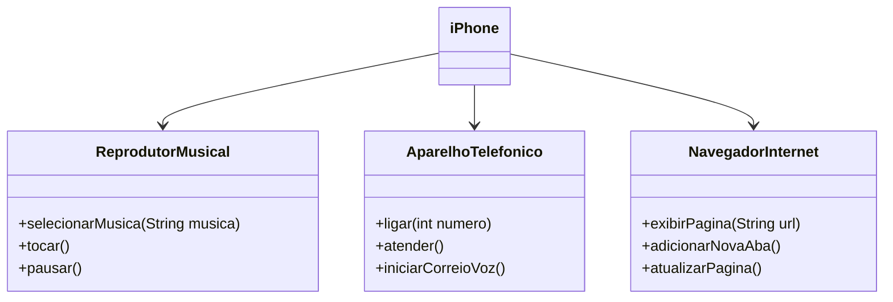

# Trilha Java Básico

### UML - iPhone

```mermaid
classDiagram
    class ReprodutorMusical {
        +selecionarMusica(String musica)
        +tocar()
        +pausar()
    }

    class AparelhoTelefonico {
        +ligar(int numero)
        +atender()
        +iniciarCorreioVoz()
    }

    class NavegadorInternet {
        +exibirPagina(String url)
        +adicionarNovaAba()
        +atualizarPagina()
    }

    class iPhone {
    }

    iPhone --> ReprodutorMusical
    iPhone --> AparelhoTelefonico
    iPhone --> NavegadorInternet
```